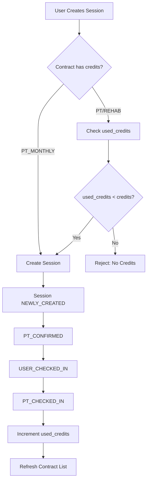

# Credits Tracking Feature - Implementation Plan

## Overview
Implement a credit tracking system for PT and REHAB contracts to show original credits and used credits (based on PT_CHECKED_IN history records). Prevent creating new sessions when credits are exhausted.

## Current System Understanding

### Contract Types with Credits
- **PT (Personal Training)**: Has credits field
- **REHAB (Rehabilitation)**: Has credits field  
- **PT_MONTHLY**: No credits field (monthly subscription)

### History Status Flow
```
NEWLY_CREATED → PT_CONFIRMED → USER_CHECKED_IN → PT_CHECKED_IN
                                                    ↓
                                              (Credits consumed)
```

### Key Components
- **API**: [`src/app/api/contract/getAll/route.ts`](src/app/api/contract/getAll/route.ts)
- **Type Definitions**: [`src/app/type/api/index.ts`](src/app/type/api/index.ts)
- **Contract Card**: [`src/components/cards/ContractCard.tsx`](src/components/cards/ContractCard.tsx)
- **History Hooks**: [`src/hooks/useHistory.ts`](src/hooks/useHistory.ts)
- **Create History API**: [`src/app/api/history/create/route.ts`](src/app/api/history/create/route.ts)
- **Update History Status API**: [`src/app/api/history/updateStatus/route.ts`](src/app/api/history/updateStatus/route.ts)

## Implementation Steps

### 1. Update Type Definitions

**File**: [`src/app/type/api/index.ts`](src/app/type/api/index.ts)

Add `used_credits` field to Contract interface:

```typescript
export interface Contract {
    id: string
    created_at: number
    start_date?: number
    end_date?: number
    kind: ContractKind
    credits?: number
    used_credits?: number  // NEW: Number of PT_CHECKED_IN history records
    status: ContractStatus
    money: number
    sale_by?: string
    purchased_by: string
    users?: User[]
    sale_by_user?: User[]
    purchased_by_user?: User[]
    history?: History[]
}
```

### 2. Modify Contract GetAll API

**File**: [`src/app/api/contract/getAll/route.ts`](src/app/api/contract/getAll/route.ts)

**Changes**:
- After fetching contracts (lines 62-131), calculate `used_credits` for each contract
- Query history records linked to each contract where `status === 'PT_CHECKED_IN'`
- Add the count to each contract object before returning

**Implementation Approach**:
```typescript
// After fetching contracts and before returning (around line 179)
// Calculate used_credits for each contract
for (const contract of contracts) {
  // Count history records with status PT_CHECKED_IN for this contract
  const usedCreditsCount = contract.history?.filter(
    (h: any) => h.status === 'PT_CHECKED_IN'
  ).length || 0
  
  contract.used_credits = usedCreditsCount
}
```

**Note**: The API already fetches `history` relationship for contracts (lines 75, 98, 122), so we can use that data directly.

### 3. Update ContractCard Component

**File**: [`src/components/cards/ContractCard.tsx`](src/components/cards/ContractCard.tsx)

**Changes**:
- Display both original credits and used credits in the header section
- Calculate remaining credits (original - used)
- Update the credits display to show: "5 / 10 Credits" (used / total)
- Add color coding: green if credits available, red if exhausted

**Location**: Lines 155-160 (current credits display)

**New Display**:
```typescript
{hasCredits && contract.credits !== undefined && (
  <div className="bg-white/20 backdrop-blur-sm px-2 py-1 rounded-lg shrink-0">
    <Text className="text-white text-xs font-bold block leading-none text-center">
      {contract.used_credits || 0} / {contract.credits}
    </Text>
    <Text className="text-white/80 text-[10px] block mt-0.5 text-center">
      Credits Used
    </Text>
  </div>
)}
```

### 4. Add Credit Validation - Create Session Button

**File**: [`src/components/cards/ContractCard.tsx`](src/components/cards/ContractCard.tsx)

**Changes**:
- Update `shouldShowCreateSession` logic (lines 122-129)
- Check if contract has available credits before showing button
- Only applicable for PT and REHAB contracts (those with credits field)

**Updated Logic**:
```typescript
// Check if contract has available credits (for PT/REHAB)
const hasAvailableCredits = !hasCredits || 
  (contract.credits && (contract.used_credits || 0) < contract.credits)

const shouldShowCreateSession = contract.status === 'ACTIVE' && 
  hasAvailableCredits &&
  (
    (userRole === 'CUSTOMER' && contract.purchased_by === userInstantId) ||
    userRole === 'ADMIN' ||
    userRole === 'STAFF'
  )
```

### 5. Add Backend Validation - Create History API

**File**: [`src/app/api/history/create/route.ts`](src/app/api/history/create/route.ts)

**Changes**:
- After checking contract status (line 143-149)
- Before creating the history record
- Check if contract has credits field (PT/REHAB only)
- Query history records with status PT_CHECKED_IN
- Reject if used_credits >= original credits

**Implementation**:
```typescript
// After line 149 (contract status check)
// Check credits for PT and REHAB contracts
if (contract.kind === 'PT' || contract.kind === 'REHAB') {
  if (!contract.credits) {
    return NextResponse.json(
      { error: 'Contract does not have credits assigned' },
      { status: 400 }
    )
  }

  // Query history records with PT_CHECKED_IN status for this contract
  const checkedInHistoryData = await instantServer.query({
    history: {
      $: {
        where: {
          status: 'PT_CHECKED_IN'
        }
      },
      contract: {
        $: {
          where: {
            id: contract_id
          }
        }
      }
    }
  })

  const usedCredits = checkedInHistoryData.history?.length || 0

  if (usedCredits >= contract.credits) {
    return NextResponse.json(
      { error: `No credits available. Used ${usedCredits} of ${contract.credits} credits.` },
      { status: 400 }
    )
  }
}
```

### 6. Filter Contracts in CreateSessionModal

**File**: [`src/components/modals/CreateSessionModal.tsx`](src/components/modals/CreateSessionModal.tsx)

**Changes**:
- Update `activeContracts` filtering (lines 44-55)
- Exclude contracts with exhausted credits

**Updated Filter**:
```typescript
const activeContracts = useMemo(() => {
  if (!contractsData) return []

  const allContracts = contractsData.pages.flatMap(page =>
    'contracts' in page ? page.contracts : []
  )

  // Filter to only active contracts with available credits
  return allContracts.filter(c => {
    if (c.status !== 'ACTIVE') return false
    
    // For PT/REHAB contracts, check if credits are available
    const hasCreditsField = c.kind === 'PT' || c.kind === 'REHAB'
    if (hasCreditsField && c.credits) {
      const usedCredits = c.used_credits || 0
      return usedCredits < c.credits
    }
    
    // For PT_MONTHLY, no credit check needed
    return true
  })
}, [contractsData])
```

### 7. Invalidate Contract Queries on History Status Change

**File**: [`src/hooks/useHistory.ts`](src/hooks/useHistory.ts)

**Changes**:
- Update `useUpdateHistoryStatus` hook (lines 243-253)
- Invalidate contract queries when history status changes successfully
- This ensures credit counts refresh when a session reaches PT_CHECKED_IN status

**Updated Hook**:
```typescript
export function useUpdateHistoryStatus() {
    const queryClient = useQueryClient()

    return useMutation({
        mutationFn: updateHistoryStatus,
        onSuccess: () => {
            // Invalidate and refetch history list
            queryClient.invalidateQueries({ queryKey: historyKeys.lists() })
            // NEW: Invalidate contracts to refresh used_credits count
            queryClient.invalidateQueries({ queryKey: contractKeys.lists() })
        }
    })
}
```

## Data Flow Diagram



## UI Changes Summary

### ContractCard Display
**Before**:
```
┌─────────────────────┐
│ PT                  │ 10 Credits
│ Status: Active      │
└─────────────────────┘
```

**After**:
```
┌─────────────────────┐
│ PT                  │ 3 / 10 Credits Used
│ Status: Active      │
└─────────────────────┘
```

### Create Session Button Visibility
- **Show**: Active contract with available credits (used < total)
- **Hide**: Contract with exhausted credits (used >= total)

## Error Messages

### API Validation Errors
1. **Credit Exhausted**: `"No credits available. Used {used} of {total} credits."`
2. **No Credits Field**: `"Contract does not have credits assigned"`

### UI Feedback
- When trying to create a session for exhausted contract: Show error from API
- Contracts with no credits automatically filtered from dropdown in modal

## Testing Checklist

- [ ] Contract with 10 credits shows "0 / 10" initially
- [ ] After 3 sessions reach PT_CHECKED_IN, shows "3 / 10"
- [ ] After 10 sessions reach PT_CHECKED_IN, shows "10 / 10"
- [ ] Create Session button hidden when used >= total
- [ ] Cannot create session via API when credits exhausted
- [ ] PT_MONTHLY contracts unaffected (no credit checks)
- [ ] History status change to PT_CHECKED_IN updates contract display
- [ ] CANCELED or EXPIRED sessions don't count toward used_credits

## Notes

- Only `PT_CHECKED_IN` status counts as used credit (not CANCELED, EXPIRED, etc.)
- PT_MONTHLY contracts are unaffected (no credit system)
- Credits are read-only calculated field (not stored separately)
- Real-time updates via React Query invalidation
