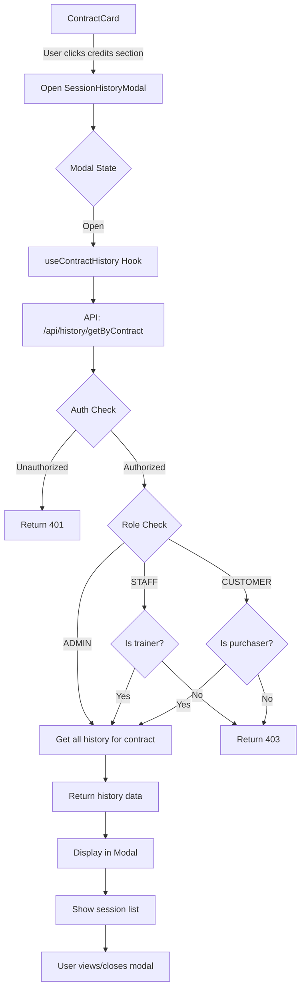
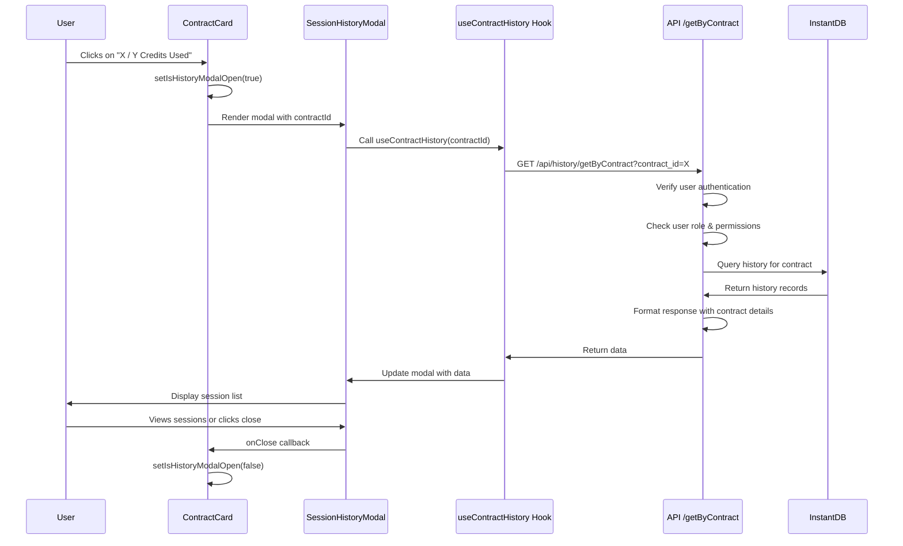
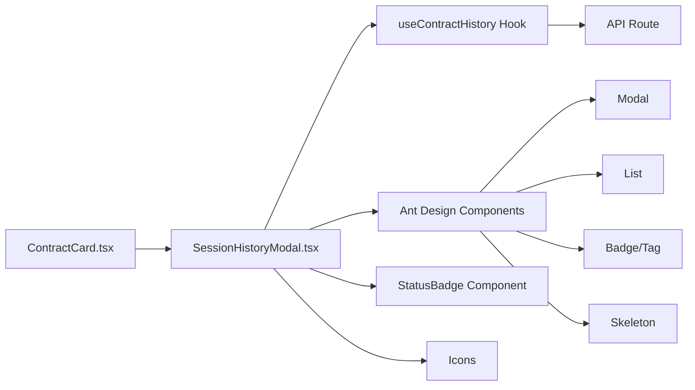
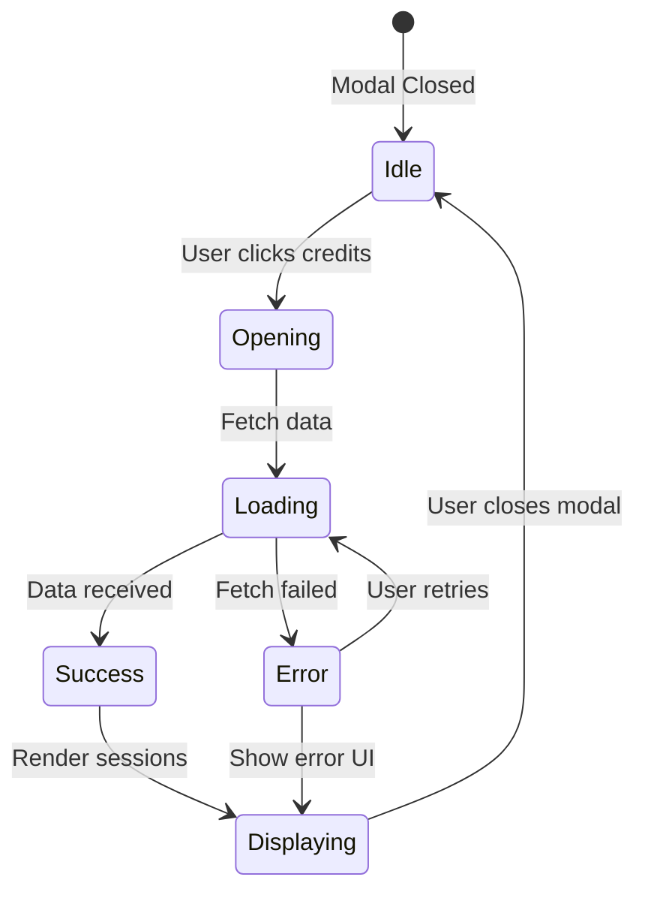

# Session History Modal - Architecture Diagram

## Component Flow Diagram



## Data Flow



## Component Structure



## State Management



## Access Control Matrix

| Role | Can View Own Contracts | Can View Others' Contracts | Can View Taught Sessions |
|------|----------------------|--------------------------|------------------------|
| **CUSTOMER** | ✅ Yes | ❌ No | ❌ No |
| **STAFF** | ✅ Yes | ❌ Only if trainer | ✅ Yes |
| **ADMIN** | ✅ Yes | ✅ Yes | ✅ Yes |

## API Endpoint Specification

### Request
```
GET /api/history/getByContract?contract_id={id}
```

### Authorization Headers
```
Authorization: Bearer {clerk_jwt_token}
```

### Response (Success - 200)
```json
{
  "history": [
    {
      "id": "hist_123",
      "date": 1704441600000,
      "from": 480,
      "to": 540,
      "status": "PT_CHECKED_IN",
      "teach_by": "user_456",
      "users": [...],
      "contract": [...]
    }
  ],
  "contract": {
    "id": "contract_789",
    "kind": "PT",
    "credits": 10,
    "used_credits": 8,
    "status": "ACTIVE",
    ...
  },
  "role": "CUSTOMER"
}
```

### Response (Error - 401/403)
```json
{
  "error": "Unauthorized - Please sign in"
}
```

### Response (Error - 404)
```json
{
  "error": "Contract not found"
}
```

## UI Component Hierarchy

```
SessionHistoryModal
├── Modal (Ant Design)
│   ├── Modal.Header
│   │   ├── Contract Type Badge
│   │   ├── Title
│   │   └── Close Button
│   ├── Modal.Body
│   │   ├── Contract Summary Card
│   │   │   ├── Contract Status
│   │   │   ├── Total Sessions Count
│   │   │   └── Credits Info
│   │   ├── Loading State (Skeleton)
│   │   ├── Error State (Alert + Retry)
│   │   ├── Empty State (Empty component)
│   │   └── Session List
│   │       └── Session Items (List.Item)
│   │           ├── Date Display
│   │           ├── Time Range
│   │           ├── Status Badge
│   │           └── Session Icon
│   └── Modal.Footer
│       └── Summary Statistics
│           ├── Completed Count
│           ├── Upcoming Count
│           └── Remaining Credits
```

## File Dependency Graph

```mermaid
graph TD
    A[ContractCard.tsx] -->|imports| B[SessionHistoryModal.tsx]
    B -->|imports| C[useHistory.ts]
    C -->|calls| D[/api/history/getByContract/route.ts]
    D -->|uses| E[dbServer.ts]
    D -->|uses| F[Clerk Auth]
    B -->|imports| G[StatusBadge.tsx]
    B -->|imports| H[timeUtils.ts]
    C -->|imports| I[api/index.ts - Types]
    D -->|imports| I
    B -->|imports| J[Ant Design]
```

## Key Design Decisions

### 1. Separate API Endpoint
- **Why**: Existing `/getAll` endpoint returns all history, not contract-specific
- **Benefit**: Better performance, clearer intent, easier caching

### 2. Role-Based Access in Backend
- **Why**: Security - don't trust frontend filtering
- **Benefit**: Proper authorization, prevents data leaks

### 3. Modal Over Inline List
- **Why**: Better UX, doesn't clutter contract card, focused view
- **Benefit**: Users can see full details without navigation

### 4. React Query Hook
- **Why**: Consistent with existing patterns, automatic caching
- **Benefit**: Less boilerplate, better performance, loading states

### 5. Chronological Order (Newest First)
- **Why**: Users care most about recent sessions
- **Benefit**: Most relevant info at top, natural flow

## Performance Optimizations

1. **React Query Caching**: Cache history data for 5 minutes
2. **Lazy Loading**: Only fetch when modal opens
3. **Memoization**: Use useMemo for computed values
4. **Virtualization**: If > 50 sessions, consider react-window

## Accessibility Features

1. **Keyboard Navigation**: Tab through sessions, ESC to close
2. **ARIA Labels**: Proper labels for screen readers
3. **Focus Management**: Focus modal on open, restore on close
4. **Color Contrast**: WCAG AA compliant colors
5. **Semantic HTML**: Proper heading hierarchy

## Mobile Responsiveness

- Full-screen modal on mobile (< 768px)
- Larger touch targets (min 44px)
- Simplified layout for small screens
- Swipe down to close gesture
- Sticky header with contract info
